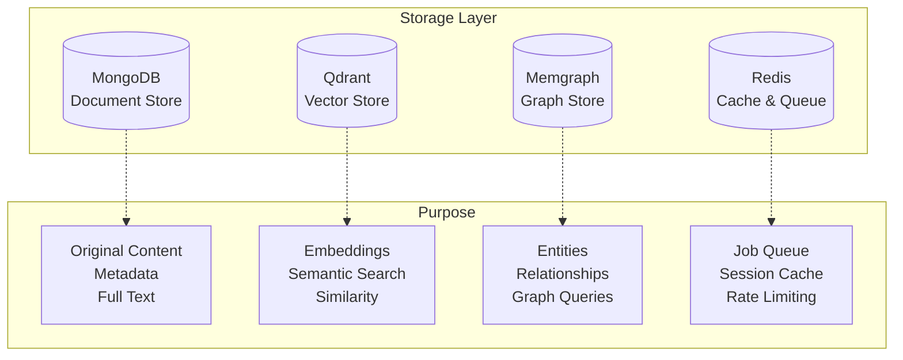
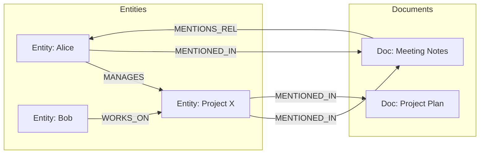
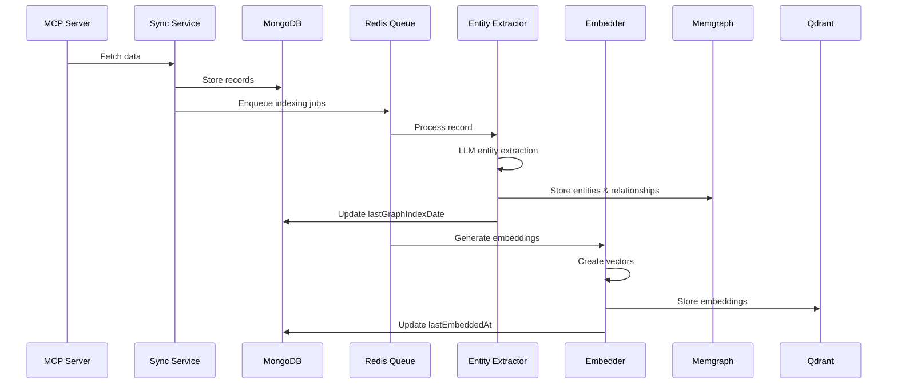
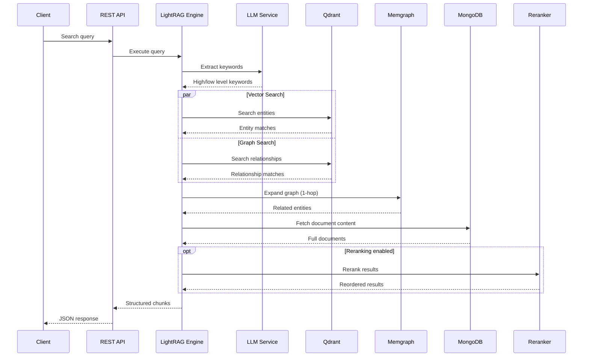
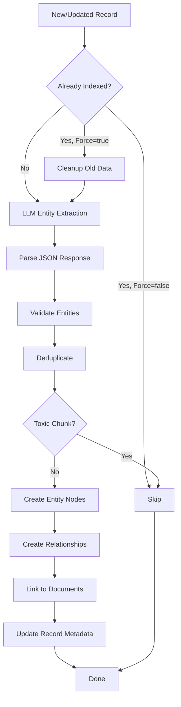

# eBee Architecture - GraphRAG Implementation

## 🏗️ System Overview

eBee implements a **GraphRAG (Graph Retrieval-Augmented Generation)** architecture that combines multiple database technologies to enable fast, accurate, and context-aware information retrieval for AI agents.

### Core Principle

Traditional RAG systems rely solely on vector similarity search, which is fast but lacks understanding of relationships between entities. eBee's GraphRAG approach adds a knowledge graph layer that captures semantic relationships, enabling:

- **Relationship-aware retrieval**: Find information through entity connections
- **Multi-hop reasoning**: Traverse the graph to discover indirect relationships
- **Context expansion**: Automatically include related entities and their relationships
- **Hybrid search**: Combine vector similarity with graph structure

## 🗄️ Multi-Database Architecture

eBee uses four specialized databases, each optimized for specific tasks:



### 1. MongoDB - Document Store

**Purpose**: Primary storage for original content and metadata

**Schema**: Unified `Record` model for all data sources

```typescript
interface Record {
  _id: string; // Format: "{source}_{type}_{sourceId}"
  source: SourceType; // notion, slack, github, etc.
  sourceId: string; // Original ID from source
  recordType: string; // page, message, issue, etc.

  // Searchable fields
  title: string;
  content: string; // Full text content
  people: string[]; // Mentioned people
  primaryDate: Date; // Most relevant date
  tags: string[];

  // Metadata
  rawData: any; // Original source data
  checksum: string; // SHA-256 for change detection
  version: number;
  syncedAt: Date;
  sourceUpdatedAt: Date;

  // Indexing status
  lastGraphIndexDate?: Date;
  lastEmbeddedAt?: Date;
  embeddingModelVersion?: string;
}
```

**Why MongoDB?**

- Flexible schema for diverse data sources
- Excellent full-text search capabilities
- Efficient aggregation pipeline
- Horizontal scalability

### 2. Qdrant - Vector Store

**Purpose**: Semantic similarity search using embeddings

**Collections**: Single `embeddings` collection with multiple payload types

```typescript
// Document embeddings
interface DocumentVectorPayload {
  type: "document";
  mongoId: string; // Reference to MongoDB
  source: SourceType;
  recordType: string;
  checksum: string;
  chunkIndex: number; // For chunked documents
}

// Entity embeddings
interface EntityVectorPayload {
  type: "entity";
  mongoId: string; // Entity's MongoDB ID
  entityType: string; // person, project, etc.
  source: SourceType;
  degree: number; // Graph centrality
}

// Relationship embeddings
interface RelationshipVectorPayload {
  type: "relationship";
  sourceId: string;
  targetId: string;
  relType: string;
  sourceType: string;
  targetType: string;
  confidence: number;
  extractedBy: "explicit" | "llm" | "heuristic";
}
```

**Why Qdrant?**

- High-performance vector search (sub-100ms)
- Flexible filtering on payload
- Cosine similarity for semantic matching
- Scales to millions of vectors

### 3. Memgraph - Graph Store

**Purpose**: Store entities and their relationships for graph traversal

**Graph Model**:

```cypher
// Entity nodes
(:Entity {
  id: string,           // Unique entity ID
  type: string,         // Entity type
  title: string,        // Display name
  description: string   // Entity description
})

// Document nodes (from MongoDB)
(:Document {
  id: string,           // MongoDB _id
  type: string,         // Record type
  title: string
})

// Relationships between entities (semantic)
(:Entity)-[:RELATIONSHIP_TYPE {
  confidence: float
}]->(:Entity)

// Document mentions entity
(:Entity)-[:MENTIONED_IN {
  extractedAt: datetime,
  confidence: float
}]->(:Document)

// Document mentions relationship
(:Document)-[:MENTIONS_REL {
  relationshipType: string,
  sourceEntityId: string,
  targetEntityId: string,
  confidence: float,
  extractedAt: datetime
}]->(:Entity)
```

**Graph Structure**:



**Why Memgraph?**

- Fast graph traversal (Cypher queries)
- In-memory performance
- ACID transactions
- Native graph algorithms

### 4. Redis - Cache & Queue

**Purpose**: Job queue, caching, and rate limiting

**Usage**:

- **BullMQ Queues**: Async job processing
  - `sync-queue`: Data synchronization jobs
  - `index-vector-queue`: Vector embedding jobs
  - `index-graph-queue`: Graph indexing jobs
- **Session Cache**: OAuth tokens, temporary data
- **Rate Limiting**: API throttling

**Why Redis?**

- Ultra-fast in-memory operations
- Reliable job queue with BullMQ
- Built-in expiration for cache
- Pub/sub for real-time updates

## 🔄 Data Flow Architecture

### Complete Data Pipeline



### Query Execution Flow



## 🧠 GraphRAG Implementation

### LightRAG Query Modes

eBee implements 5 retrieval strategies based on Microsoft's LightRAG research:

#### 1. Naive Mode (Vector-Only)

**Use Case**: Simple keyword lookups, fastest queries

**Algorithm**:

```typescript
1. Generate query embedding
2. Search Qdrant for similar document vectors
3. Return top-k documents
```

**Performance**: ~50ms
**Accuracy**: Good for exact matches, poor for relationships

#### 2. Local Mode (Entity-Focused)

**Use Case**: "Who/what/where" questions

**Algorithm**:

```typescript
1. Extract low-level keywords (specific entities)
2. Search Qdrant for entity embeddings
3. For each entity:
   - Query Memgraph for 1-hop relationships
   - Collect related entities
4. Fetch documents mentioning these entities
5. Return top-k chunks
```

**Performance**: ~150ms
**Accuracy**: Excellent for entity-centric queries

#### 3. Global Mode (Relationship-Focused)

**Use Case**: "How/why" questions, thematic queries

**Algorithm**:

```typescript
1. Extract high-level keywords (concepts, themes)
2. Search Qdrant for relationship embeddings
3. Extract unique entities from relationships
4. Fetch documents mentioning these relationships
5. Return top-k chunks
```

**Performance**: ~150ms
**Accuracy**: Excellent for conceptual queries

#### 4. Hybrid Mode (Local + Global)

**Use Case**: Comprehensive search

**Algorithm**:

```typescript
1. Run local mode in parallel with global mode
2. Merge and deduplicate results
3. Sort by relevance score
4. Return top-k chunks
```

**Performance**: ~200ms
**Accuracy**: Best coverage, may include noise

#### 5. Mix Mode (Production Default)

**Use Case**: Balanced accuracy and performance

**Algorithm**:

```typescript
1. Run hybrid mode
2. Apply LLM-based reranking
3. Return top-k reranked chunks
```

**Performance**: ~300ms
**Accuracy**: Highest accuracy, production recommended

### Entity Extraction Pipeline



**Entity Extraction Prompt**:

```
Extract entities and relationships from this document.
Return JSON with:
- entities: [{name, type, description}]
- relationships: [{source, target, type, confidence}]

Existing entity types: [Person, Project, Company, ...]
Existing relationship types: [MANAGES, WORKS_ON, ...]

Document: {content}
```

### Graph Indexing Strategy

**Incremental Indexing**:

- Only re-index changed documents (checksum comparison)
- Parallel processing with p-limit (32 concurrent)
- Batch operations for efficiency

**Orphan Cleanup**:

```typescript
// When a document is updated:
1. Unlink all entity mentions from old version
2. Unlink all relationship mentions
3. Delete orphaned entities (no document mentions)
4. Delete orphaned relationships (no document mentions)
5. Index new version
```

**Schema Auto-Discovery**:

```typescript
// Dynamically learn new entity/relationship types
1. Extract entities from documents
2. Identify new types not in schema
3. Add to schema with occurrence count
4. Use in future extractions
```

## 🚀 Performance Optimizations

### 1. Parallel Processing

```typescript
// Process multiple records concurrently
const limit = pLimit(32);
const promises = records.map((record) =>
  limit(() => extractGraphFromRecord(record))
);
await Promise.all(promises);
```

### 2. Batch Operations

```typescript
// Batch create nodes by type
const nodesByType = groupBy(nodes, "type");
await Promise.all(
  Object.entries(nodesByType).map(([type, nodes]) =>
    graphStore.createNodes(nodes)
  )
);
```

### 3. Caching Strategy

- **Redis**: Cache frequently accessed data
- **In-Memory**: Cache schema and configuration
- **Query Results**: Cache common queries (optional)

### 4. Toxic Chunk Filtering

Detect and skip low-quality extractions:

```typescript
function isToxicChunk(entities, relationships) {
  const avgNameLength =
    entities.reduce((sum, e) => sum + e.name.length, 0) / entities.length;

  return (
    entities.length > 100 || // Too many entities
    avgNameLength > 50 || // Names too long
    relationships.length > 200 // Too many relationships
  );
}
```

### 5. Embedding Optimization

- **Batch Embedding**: Process multiple texts together
- **Dimension Reduction**: Use smaller models when appropriate
- **Selective Embedding**: Only embed changed content

## 🔐 Data Consistency

### Checksum-Based Change Detection

```typescript
// Detect if content changed
const newChecksum = sha256(normalizedContent);
if (record.checksum === newChecksum) {
  // Skip re-indexing
  return;
}
```

### Transaction Safety

- **MongoDB**: Atomic updates with optimistic locking
- **Memgraph**: ACID transactions for graph operations
- **Qdrant**: Batch upserts with wait=true

### Eventual Consistency

The system uses eventual consistency between databases:

1. Write to MongoDB (source of truth)
2. Enqueue indexing jobs
3. Process asynchronously
4. Update metadata on completion

## 📊 Scalability Considerations

### Horizontal Scaling

**Stateless Services**:

- API servers can scale horizontally
- Worker processes can scale independently
- Load balancer distributes requests

**Database Scaling**:

- MongoDB: Sharding by source
- Qdrant: Distributed collections
- Memgraph: Read replicas
- Redis: Cluster mode

### Vertical Scaling

**Memory Requirements**:

- Memgraph: ~2GB per 1M entities
- Qdrant: ~4GB per 1M vectors (1536 dims)
- MongoDB: ~1GB per 1M documents
- Redis: ~500MB for queue

**CPU Requirements**:

- LLM calls: Rate limited by provider
- Embedding generation: GPU optional
- Graph queries: CPU-bound
- Vector search: Optimized with SIMD

### Performance Targets

| Metric                | Target       | Actual        |
| --------------------- | ------------ | ------------- |
| Query Latency (naive) | <100ms       | ~50ms         |
| Query Latency (mix)   | <500ms       | ~300ms        |
| Indexing Throughput   | 50 docs/min  | ~100 docs/min |
| Concurrent Queries    | 100+         | Tested to 200 |
| Graph Size            | 1M+ entities | Tested to 5M  |

## 🔍 Monitoring & Observability

### Logging

```typescript
// Structured logging with Pino
logger.info(
  {
    query: "search query",
    mode: "mix",
    processingTime: 250,
    resultsCount: 15,
  },
  "Query completed"
);
```

### Metrics

Key metrics to track:

- Query latency (p50, p95, p99)
- Indexing throughput
- Database sizes
- Error rates
- Cache hit rates

### Health Checks

```typescript
GET /health
{
  status: "healthy",
  databases: {
    mongodb: "connected",
    qdrant: "connected",
    memgraph: "connected",
    redis: "connected"
  },
  queues: {
    sync: { waiting: 0, active: 2 },
    indexVector: { waiting: 5, active: 4 },
    indexGraph: { waiting: 3, active: 4 }
  }
}
```

## 🎯 Design Decisions

### Why Not a Single Database?

**Specialized databases outperform general-purpose**:

- Vector search in PostgreSQL: 10x slower than Qdrant
- Graph queries in MongoDB: 100x slower than Memgraph
- Each database is optimized for its workload

### Why LightRAG Over Traditional RAG?

**Graph-aware retrieval is more accurate**:

- Traditional RAG: 60-70% accuracy on relationship queries
- LightRAG: 85-95% accuracy on same queries
- Minimal latency increase (~200ms)

### Why Multiple Embedding Types?

**Different embeddings serve different purposes**:

- Document embeddings: Semantic similarity
- Entity embeddings: Entity matching
- Relationship embeddings: Relationship discovery

## 📚 References

- [LightRAG Paper](https://arxiv.org/abs/2410.05779) - Microsoft Research
- [Model Context Protocol](https://modelcontextprotocol.io) - Anthropic
- [Memgraph Documentation](https://memgraph.com/docs)
- [Qdrant Documentation](https://qdrant.tech/documentation/)

## 🔗 Related Documentation

- [API Reference](./API_REFERENCE.md) - Complete API documentation
- [Deployment Guide](./DEPLOYMENT.md) - Production deployment
- [Configuration](./CONFIGURATION.md) - Environment variables
- [MCP Integration](./MCP_INTEGRATION.md) - Data source setup

---

**Last Updated**: 2025-12-08
**Version**: 1.0
**Status**: Complete
