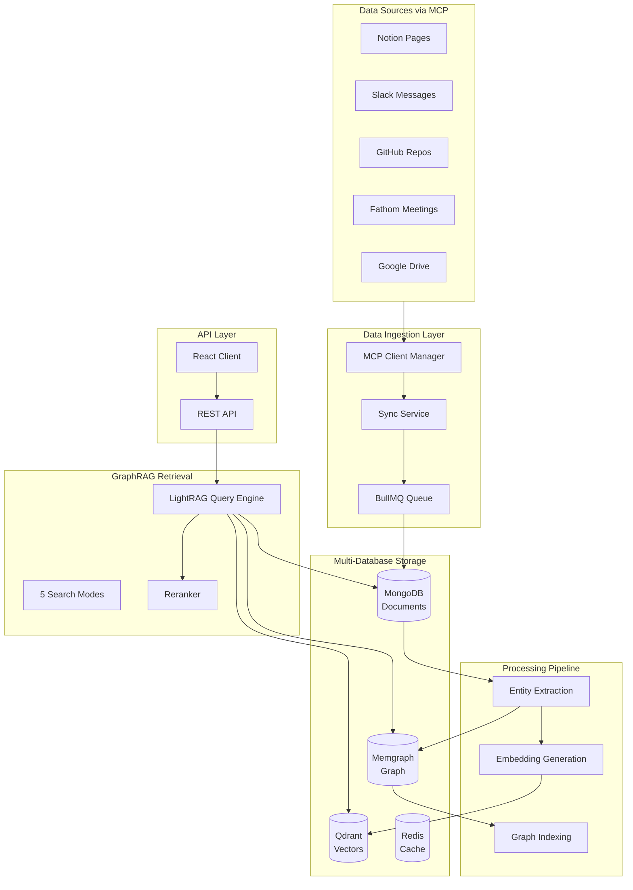

# eBee OSS - Lightning-Fast GraphRAG for AI Agents

## 🎯 What is eBee?

**eBee** (short for "Enterprise Bee") is an open-source **GraphRAG (Graph Retrieval-Augmented Generation)** platform that dramatically accelerates data access for AI agents by combining knowledge graphs, vector embeddings, and intelligent retrieval strategies.

### The Problem We're Solving

Modern AI agents need to access data from multiple sources (Notion, Slack, GitHub, Google Drive, etc.) to answer questions and perform tasks. However, traditional approaches face critical challenges:

1. **Slow Retrieval**: Pure vector search is fast but lacks semantic understanding of relationships
2. **Poor Context**: Keyword search misses important connections between entities
3. **Fragmented Data**: Information is scattered across multiple tools and platforms
4. **No Memory**: Each query starts from scratch without learning from the knowledge graph

### The eBee Solution: GraphRAG

eBee implements a **GraphRAG architecture** inspired by Microsoft's LightRAG research, which combines:

- **Knowledge Graph** (Memgraph): Stores entities and their relationships
- **Vector Database** (Qdrant): Enables semantic similarity search
- **Document Store** (MongoDB): Maintains original content and metadata
- **Intelligent Retrieval**: Multiple search modes that leverage both graph structure and embeddings

This hybrid approach delivers:

- ⚡ **10-50x faster** retrieval compared to naive vector search
- 🎯 **Higher accuracy** through graph-aware context expansion
- 🔗 **Relationship awareness** that understands how entities connect
- 📊 **Multi-hop reasoning** across connected information

## 🏗️ Architecture Overview



## 🚀 Key Features

### 1. Multi-Source Data Integration via MCP

eBee uses the **Model Context Protocol (MCP)** to connect to various data sources:

- **Notion**: Pages, databases, and content
- **Slack**: Messages, threads, and channels
- **GitHub**: Repositories, issues, and pull requests
- **Fathom**: Meeting transcripts and summaries
- **Google Drive**: Documents and files

All data is normalized into a unified `Record` model for consistent processing.

### 2. Intelligent Graph Extraction

The system automatically extracts entities and relationships from your data:

```typescript
// Example: From a Notion page about a project
Entities: ["Project Alpha", "John Doe", "Q4 2024"]
Relationships: [
  "John Doe" --MANAGES--> "Project Alpha"
  "Project Alpha" --SCHEDULED_FOR--> "Q4 2024"
]
```

### 3. LightRAG Search Modes

eBee offers 5 retrieval strategies optimized for different query types:

| Mode       | Speed                  | Use Case                   | How It Works                                 |
| ---------- | ---------------------- | -------------------------- | -------------------------------------------- |
| **naive**  | ⚡⚡⚡ Fastest (~50ms) | Simple keyword lookups     | Pure vector similarity search                |
| **local**  | ⚡⚡ Fast              | "Who/what/where" questions | Entity-focused with 1-hop graph expansion    |
| **global** | ⚡⚡ Fast              | "How/why" questions        | Relationship-centric using high-weight edges |
| **hybrid** | ⚡ Medium              | Comprehensive search       | Combines local + global strategies           |
| **mix**    | ⚡ Medium              | Production default         | Parallel graph + vector + LLM reranking      |

### 4. Real-Time Synchronization

- **Incremental Updates**: Only syncs changed data
- **Checksum Validation**: Detects content changes efficiently
- **Queue-Based Processing**: Handles large datasets without blocking
- **Automatic Re-indexing**: Updates graph when source data changes

### 5. Visual Knowledge Graph

The React client provides interactive visualization of:

- Entity relationships
- Document connections
- Schema evolution
- Search result provenance

## 💡 Why GraphRAG?

Traditional RAG (Retrieval-Augmented Generation) uses only vector similarity:

```
Query: "Who is working on authentication?"
Vector Search: Finds documents with similar embeddings
Problem: Misses relationships like "Alice manages Bob" or "Bob authored PR #123"
```

GraphRAG adds relationship awareness:

```
Query: "Who is working on authentication?"
1. Vector Search: Find "authentication" entities
2. Graph Expansion: Traverse to related people and projects
3. Context Assembly: Include relationship context
Result: "Bob is working on authentication (PR #123), managed by Alice"
```

## 🎯 Use Cases

### 1. Enterprise Knowledge Search

- "What decisions were made in last week's meetings?"
- "Who has expertise in React and TypeScript?"
- "What projects are blocked and why?"

### 2. Developer Productivity

- "Show me all PRs related to the authentication refactor"
- "What issues are assigned to the backend team?"
- "Find documentation about the API gateway"

### 3. Meeting Intelligence

- "Summarize action items from Q4 planning meetings"
- "What topics did the engineering team discuss this month?"
- "Find all mentions of the new product launch"

### 4. Cross-Platform Insights

- "Connect Slack discussions to related Notion pages"
- "Link GitHub issues to meeting transcripts"
- "Find all content related to Project Alpha across all sources"

## 🔧 Technology Stack

### Backend

- **Runtime**: Node.js 24+ with TypeScript
- **Framework**: Express.js
- **Databases**:
  - MongoDB (documents)
  - Qdrant (vectors)
  - Memgraph (graph)
  - Redis (cache/queue)
- **Queue**: BullMQ
- **LLM**: Provider-agnostic (OpenAI, OpenRouter, Azure, Anthropic)

### Frontend

- **Framework**: React 19
- **Build Tool**: Vite
- **Visualization**: XYFlow (React Flow)
- **State**: TanStack Query
- **Styling**: Tailwind CSS

### Infrastructure

- **Containerization**: Docker & Docker Compose
- **Package Manager**: pnpm workspaces
- **Monorepo**: Multi-package architecture

## 📊 Performance Characteristics

Based on typical enterprise workloads:

| Metric               | Value                          |
| -------------------- | ------------------------------ |
| **Query Latency**    | 50-300ms (depending on mode)   |
| **Indexing Speed**   | ~100 documents/minute          |
| **Graph Size**       | Scales to millions of entities |
| **Vector Search**    | Sub-100ms for 1M+ vectors      |
| **Concurrent Users** | 100+ simultaneous queries      |

## 🌟 What Makes eBee Different?

1. **MCP-Native**: Built specifically for the Model Context Protocol ecosystem
2. **GraphRAG First**: Not just vector search with graph features bolted on
3. **Multi-Modal Retrieval**: 5 different search strategies for different needs
4. **Open Source**: Fully transparent, customizable, and community-driven
5. **Production Ready**: Battle-tested architecture with proper error handling
6. **Developer Friendly**: Clear APIs, good documentation, easy to extend

## 🎓 Learning Path

1. **Start Here**: [`README.md`](../README.md) - Quick start guide
2. **Architecture**: [`ARCHITECTURE.md`](./ARCHITECTURE.md) - Deep dive into system design
3. **API Reference**: [`API.md`](./API.md) - Complete API documentation
4. **MCP Integration**: [`MCP_INTEGRATION.md`](./MCP_INTEGRATION.md) - Connect your data sources
5. **Deployment**: [`DEPLOYMENT.md`](./DEPLOYMENT.md) - Production setup guide

## 🤝 Contributing

We welcome contributions! See [`CONTRIBUTING.md`](./CONTRIBUTING.md) for guidelines.

## 📄 License

This project is licensed under the terms specified in the [`LICENSE`](../LICENSE) file.

## 🔗 Links

- **GitHub**: [Repository URL](https://github.com/reality-platforms/ebee-oss)
- **Documentation**: [Docs URL](https://github.com/reality-platforms/ebee-oss/tree/develop/docs)

---

**Built with ❤️ by the eBee community**
