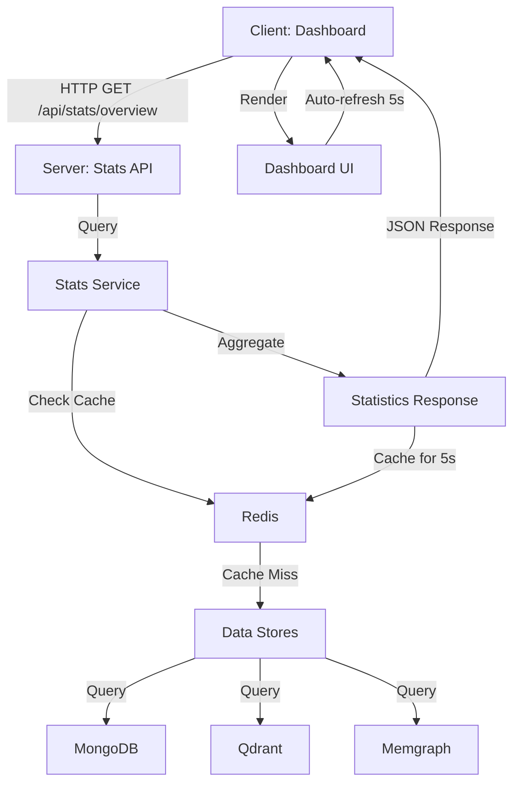

# Phase 2 Implementation Plan: Dashboard & Statistics

## 🎯 Overview

Phase 2 builds on Phase 1 (Persona Management) to add a comprehensive dashboard with real-time statistics, MCP server status monitoring, and system overview.

**Design Principles:**

- **Simplicity First**: Use polling over WebSockets for easier implementation
- **Progressive Enhancement**: Build basic features that can be extended later
- **Consistent UI**: Match Phase 1's Tailwind styling and component patterns
- **Performance**: Efficient queries and smart caching

---

## 📊 Architecture Decisions

### Backend Approach

- **Statistics Service**: Centralized service to aggregate data from all stores
- **REST API**: Simple GET endpoints for statistics
- **Caching**: Redis cache for expensive aggregation queries (5-second TTL)
- **Performance**: Optimized MongoDB aggregations and Qdrant/Memgraph queries

### Frontend Approach

- **Polling Strategy**: React Query with 5-second refetch intervals
- **State Management**: React Query for server state, no additional state management
- **Navigation**: Top navigation bar with active indicators
- **Component Structure**: Reusable cards and statistics components

---

## 🏗️ Backend Implementation

### File Structure

```
packages/server/src/
├── services/
│   └── stats/
│       ├── stats.service.ts      # Main statistics aggregation service
│       └── index.ts               # Export
├── api/
│   └── stats/
│       ├── index.ts               # Stats API routes
│       └── handlers.ts            # Request handlers
└── server.ts                      # Mount stats routes
```

### Statistics Service (`services/stats/stats.service.ts`)

**Purpose**: Aggregate statistics from MongoDB, Qdrant, and Memgraph

**Key Methods**:

```typescript
class StatsService {
  // Overview statistics
  async getOverview(): Promise<OverviewStats>;

  // Detailed record statistics
  async getRecordStats(): Promise<RecordStats>;

  // Vector database statistics
  async getVectorStats(): Promise<VectorStats>;

  // Graph database statistics
  async getGraphStats(): Promise<GraphStats>;

  // Cache helper
  private async getCached<T>(
    key: string,
    fetcher: () => Promise<T>
  ): Promise<T>;
}
```

**Data Structure**:

```typescript
interface OverviewStats {
  totalRecords: number;
  totalVectors: number;
  totalGraphNodes: number;
  totalGraphRelationships: number;
  mcpServers: {
    total: number;
    connected: number;
    disconnected: number;
  };
  bySource: {
    [source: string]: {
      records: number;
      lastSync?: Date;
    };
  };
}

interface RecordStats {
  total: number;
  bySource: { [source: string]: number };
  byType: { [type: string]: number };
  recentlyUpdated: number; // Last 24 hours
  deleted: number;
}

interface VectorStats {
  collectionName: string;
  totalPoints: number;
  indexedPoints: number;
  dimensions: number;
  model: string;
}

interface GraphStats {
  totalNodes: number;
  totalRelationships: number;
  nodesByLabel: { [label: string]: number };
  relationshipsByType: { [type: string]: number };
}
```

### API Endpoints

**1. GET /api/stats/overview**

- Returns: Overall system statistics
- Cache: 5 seconds
- Used by: Dashboard main view

**2. GET /api/stats/records**

- Returns: Detailed record statistics
- Cache: 5 seconds
- Used by: Statistics details view (future)

**3. GET /api/stats/vectors**

- Returns: Vector database statistics
- Cache: 5 seconds
- Used by: Statistics details view (future)

**4. GET /api/stats/graph**

- Returns: Graph database statistics
- Cache: 5 seconds
- Used by: Statistics details view (future)

### Implementation Queries

**MongoDB Aggregations**:

```javascript
// Total records by source
db.records.aggregate([
  { $match: { isDeleted: false } },
  { $group: { _id: "$source", count: { $sum: 1 } } },
]);

// Records by type
db.records.aggregate([
  { $match: { isDeleted: false } },
  { $group: { _id: "$recordType", count: { $sum: 1 } } },
]);

// Recently updated (last 24h)
db.records.countDocuments({
  isDeleted: false,
  syncedAt: { $gte: new Date(Date.now() - 24 * 60 * 60 * 1000) },
});
```

**Qdrant Queries**:

```typescript
// Collection info
await qdrant.client.getCollection("embeddings");

// Returns: { points_count, vectors_count, segments_count, status }
```

**Memgraph Queries**:

```cypher
// Total nodes
MATCH (n) RETURN count(n) as total

// Nodes by label
MATCH (n) RETURN labels(n)[0] as label, count(n) as count

// Total relationships
MATCH ()-[r]->() RETURN count(r) as total

// Relationships by type
MATCH ()-[r]->() RETURN type(r) as type, count(r) as count
```

---

## 🎨 Frontend Implementation

### File Structure

```
packages/client/src/
├── components/
│   ├── layout/
│   │   └── Navigation.tsx         # Top nav bar
│   ├── dashboard/
│   │   ├── StatsCard.tsx          # Reusable stat display
│   │   ├── StatsGrid.tsx          # Grid of stats cards
│   │   ├── ConnectedServices.tsx  # MCP server status
│   │   └── RecentActivity.tsx     # Recent sync activity
│   └── ui/
│       └── Card.tsx                # Enhanced card component
├── hooks/
│   ├── useStats.ts                # React Query hook for stats
│   └── useMCPServers.ts           # React Query hook for MCP servers
├── pages/
│   └── Dashboard.tsx              # Main dashboard page
├── lib/
│   └── api.ts                     # Add stats API methods
└── App.tsx                        # Add routing
```

### Component Design

#### 1. Navigation Component

```
┌─────────────────────────────────────────────────────────────┐
│ 🐝 eBee        [Dashboard] [Settings]           [User] [⚙️] │
└─────────────────────────────────────────────────────────────┘
```

**Features**:

- Active tab highlighting
- Smooth transitions
- Responsive (collapses on mobile)

#### 2. StatsCard Component

```
┌──────────────────┐
│ 📊 Title         │
│                  │
│    12,450        │
│    label         │
│                  │
│ ↑ +234 (2%)     │
└──────────────────┘
```

**Props**:

```typescript
interface StatsCardProps {
  title: string;
  value: number | string;
  label: string;
  icon: React.ReactNode;
  trend?: {
    value: number;
    direction: "up" | "down";
    percentage: number;
  };
  loading?: boolean;
}
```

#### 3. Dashboard Layout

```
┌─────────────────────────────────────────────────────────────┐
│ Navigation Bar                                              │
├─────────────────────────────────────────────────────────────┤
│                                                             │
│ Statistics Overview                                         │
│ ┌──────────────┐ ┌──────────────┐ ┌──────────────┐       │
│ │ 📄 Records   │ │ 🔍 Vectors   │ │ 🕸️ Graph     │       │
│ │   12,450     │ │   45,230     │ │   8,920      │       │
│ │   documents  │ │   embeddings │ │   nodes      │       │
│ │              │ │              │ │   15,340 rels│       │
│ └──────────────┘ └──────────────┘ └──────────────┘       │
│                                                             │
│ Connected Services                                          │
│ ┌───────────────────────────────────────────────────────┐  │
│ │ ✅ Notion     [Connected]  Last sync: 5m ago          │  │
│ │ ✅ Slack      [Connected]  Last sync: 10m ago         │  │
│ │ ⚠️  Custom    [Disconnected] Never synced             │  │
│ └───────────────────────────────────────────────────────┘  │
│                                                             │
│ Recent Activity                                             │
│ ┌───────────────────────────────────────────────────────┐  │
│ │ • Synced 234 records from Notion (5 minutes ago)      │  │
│ │ • Synced 89 messages from Slack (10 minutes ago)      │  │
│ │ • System started (1 hour ago)                         │  │
│ └───────────────────────────────────────────────────────┘  │
└─────────────────────────────────────────────────────────────┘
```

### React Query Configuration

**Polling Setup**:

```typescript
const { data: overview } = useQuery({
  queryKey: ["stats", "overview"],
  queryFn: () => statsApi.overview(),
  refetchInterval: 5000, // Poll every 5 seconds
  refetchIntervalInBackground: false, // Stop when tab inactive
  staleTime: 4000, // Consider data stale after 4 seconds
});
```

**Benefits**:

- Automatic refetching
- Background sync when tab is active
- Efficient caching
- Loading states handled automatically

### Routing

**Simple Tab-Based Navigation**:

```typescript
function App() {
  const [activeTab, setActiveTab] = useState<"dashboard" | "settings">(
    "dashboard"
  );

  return (
    <div className="min-h-screen bg-gray-50">
      <Navigation activeTab={activeTab} onTabChange={setActiveTab} />
      {activeTab === "dashboard" ? <Dashboard /> : <Settings />}
    </div>
  );
}
```

**Future**: Can easily upgrade to React Router when adding more pages

---

## 📝 Implementation Steps

### Backend (Server)

1. **Create Statistics Service** (`services/stats/stats.service.ts`)

   - Implement `getOverview()` with MongoDB, Qdrant, Memgraph queries
   - Add Redis caching with 5-second TTL
   - Handle errors gracefully

2. **Create Stats API Routes** (`api/stats/index.ts`)

   - Mount routes: GET `/api/stats/overview`, `/records`, `/vectors`, `/graph`
   - Add error handling middleware
   - Add request logging

3. **Update Server** (`server.ts`)
   - Mount stats router at `/api/stats`
   - Already has CORS configured

### Frontend (Client)

1. **Update API Client** (`lib/api.ts`)

   - Add `statsApi` with methods for all endpoints
   - Type all responses

2. **Create Base Components**

   - Navigation component
   - Enhanced Card component
   - StatsCard component with loading states

3. **Create Dashboard Components**

   - StatsGrid for metrics
   - ConnectedServices for MCP servers
   - RecentActivity for sync history

4. **Create Hooks**

   - `useStats()` with polling
   - `useMCPServers()` for connection status

5. **Build Dashboard Page**

   - Compose all components
   - Add loading and error states
   - Implement responsive layout

6. **Update App.tsx**
   - Add navigation state
   - Render Dashboard by default
   - Toggle between Dashboard and Settings

---

## 🧪 Testing Strategy

### Backend Tests

1. **Statistics Service**

   - Mock MongoDB, Qdrant, Memgraph connections
   - Test each stats method returns correct format
   - Test caching behavior

2. **API Endpoints**
   - Test all endpoints return 200 with valid data
   - Test error handling (DB connection failure)
   - Test response times are acceptable

### Frontend Tests

1. **Component Tests**

   - StatsCard renders correctly
   - Navigation switches tabs
   - Loading states display properly

2. **Integration Tests**

   - Dashboard fetches and displays stats
   - Polling updates stats automatically
   - Error states handled gracefully

3. **Manual Testing**
   - Open dashboard, verify stats display
   - Check polling updates every 5 seconds
   - Switch tabs, verify navigation works
   - Test with empty database
   - Test with multiple MCP servers

---

## 🎯 Success Criteria

Phase 2 is complete when:

- ✅ Statistics API endpoints return accurate data
- ✅ Dashboard displays all key metrics
- ✅ MCP server status shows connection state
- ✅ Recent activity displays recent syncs
- ✅ Statistics auto-update every 5 seconds
- ✅ Navigation between Dashboard and Settings works
- ✅ Loading states appear during data fetch
- ✅ Error states handled gracefully
- ✅ UI is responsive and matches Phase 1 styling
- ✅ No console errors
- ✅ Documentation is complete

---

## 🔄 Future Enhancements (Phase 3+)

### Features to Add Later

1. **Advanced Activity Tracking**

   - Store activity events in MongoDB
   - Show detailed activity log
   - Filter by type, source, date

2. **Charts and Graphs**

   - Record count over time
   - Sync frequency chart
   - Source distribution pie chart

3. **Real-time WebSockets**

   - Push updates instead of polling
   - Live sync progress
   - Instant notifications

4. **Export Functionality**

   - Export statistics as CSV/JSON
   - Generate reports
   - Download activity logs

5. **Detailed Views**
   - Click stats to see details
   - Drill-down into sources
   - View individual records

---

## 📊 Data Flow Diagram



---

## 🚀 Next Steps

After completing this plan:

1. **Switch to Code Mode** to implement the backend statistics service
2. **Implement API endpoints** and test with sample data
3. **Build frontend components** starting with reusable pieces
4. **Create Dashboard page** and integrate all components
5. **Test end-to-end** with real data
6. **Document** in `phase2-implementation.md`

Ready to proceed with implementation?
